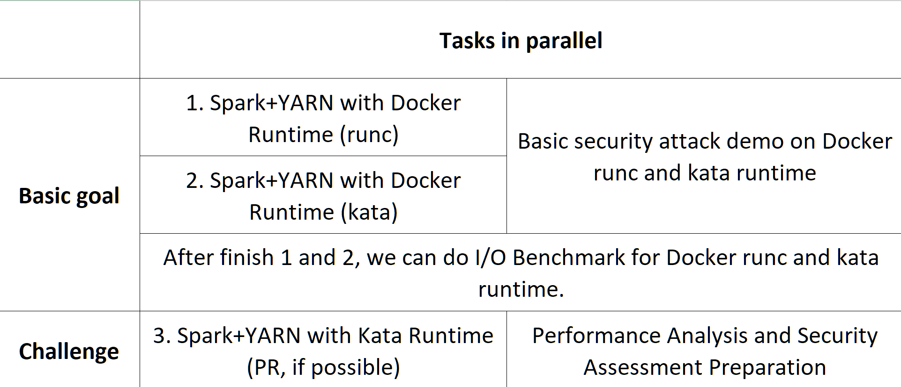
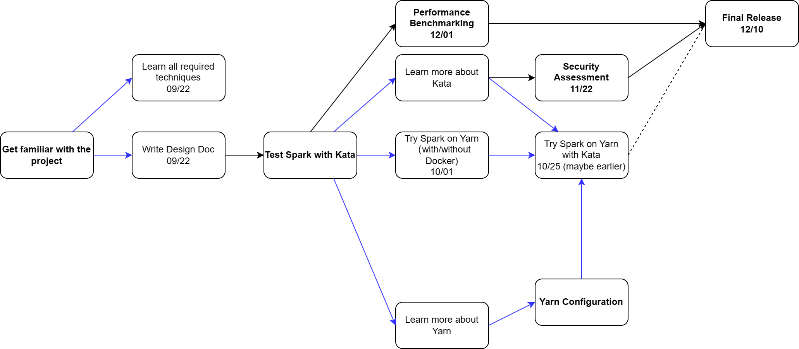

# [Kata Containers for SPARK](https://github.com/EC528-Fall-2023/Kata-Containers-for-SPARK)

## Collaborators

| **Name**                       | **Role**    | **email**  |
| ------------------------------ | ----------- | -------------------------------- |
| Karla Saur                     | Mentor      |                                  |
| Jesús Camacho Rodríguez        | Mentor      |                                  |
| Anna Pavlenko                  | Mentor      |                                  |
| Brian Kroth                    | Mentor      |                                  |
| Yingzhe(Danny) Dong            | Developer   | yzdong99@bu.edu                  |
| Richard(Rui) Wei               | Developer   | rickwei@bu.edu                   |
| Haocheng Zhao                  | Developer   | zhaohc@bu.edu                    |
| Jinquan Pan                    | Developer   | vin3nt@bu.edu                    |
| Jingwei Zhang                  | Developer   | jwz16@bu.edu                     |

** **

## Sprint 1

- presentation recording: https://bostonu.zoom.us/rec/share/-OiGa3CJQ71iLRJBKAZXCP4AW68naMUIR45OdTiJbJGVqiFFaTzC_bIyjk3Hacrl.xsRotqA5Ktk2xVG9?startTime=1695834627000 (password: h$7wCE!B)
- demo recording: https://drive.google.com/file/d/1mzXQ6GnFklAdRTKHu0T2GJegXEGs6CU5/view?usp=sharing

## 1.   Vision and Goals Of The Project:

> The vision section describes the final desired state of the project once the project is complete. It also specifies the key goals of the project. This section provides a context for decision-making. A shared vision among all team members can help ensuring that the solution meets the intended goals. A solid vision clarifies perspective and facilitates decision-making.
>
> The vision statement should be specific enough that you can look at a proposed solution and say either "yes, this meets the vision and goals", or "no, it does not".

This project is intended to enable Kata Container on Spark + YARN and perform necessary performance benchmarks and security tests, eventually we will be able to deliver a solution for deploying a Spark + YARN cluster with the Kata Container enabled and provide insights based on the performance and security analysis. The main users will be those security-sensitive users such as enterprises, government departments etc.

### Background

Nowadays, Spark workloads can be managed by YARN and each Spark job can be run in a Containerized Spark Executor. However, using traditional container technologies can expose many security vulnerabilities since all containers share the same Linux kernel. Which means the kernel is the single point of failure, once the Linux kernel has any security vulnerabilities, attackers can easily perform attacks to all the Spark Executors. 

In addition to 0-day vulnerabilities, normally there are lots of challenges to keep the Linux kernel security up-to-date, examples:

1. Kernel security patches may take time.
2. Users may not want to apply the newest security patches due to many reasons (e.g. they may be afraid of breaking the current workloads environment).

Kata Container provides a new way to create isolated containers with more security features. Each Kata Container is a lightweight VM with a traditional container included and workloads are all run in an isolated environment, even though one kernel . However there could be performance loss when using Kata Container since a lightweight VM is still a VM, the overhead is inevitable but may be mitigable.

### Goals

Therefore, the goals of our project are:

1. Deploy two Spark + YARN clusters with Kata and Docker Container enabled respectively.
2. Write scripts to perform essential performance benchmarks and security tests against both Kata Container and Docker Container configurations. Deliver a detailed report.
3. Explore solutions to mitigate performance impact that comes from VM. ([virtio-fs](https://github.com/kata-containers/kata-containers/blob/main/docs/how-to/how-to-use-virtio-fs-with-kata.md))

## 2. Users/Personas Of The Project:

> This section describes the principal user roles of the project together with the key characteristics of these roles. This information will inform the design and the user scenarios. A complete set of roles helps in ensuring that high-level requirements can be identified in the product backlog.
>
> Again, the description should be specific enough that you can determine whether user A, performing action B, is a member of the set of users the project is designed for.

### Government IT Specialist - Robert

- **Background and Role**: Robert works in the IT department of a government agency, ensuring the security and efficiency of data processing tasks. The agency deals with confidential information, making security paramount.

- **Needs and Goals**: Robert needs a secure and efficient way to run Spark jobs using YARN. He is interested in exploring Kata Container solutions to enhance security and is open to mitigating any potential performance impacts.

- **Challenges**: Government agencies can be slow to adopt new technologies. Robert must ensure that any solution is thoroughly vetted for security and performance.

### Security-Conscious Enterprise Administrator – Sarah

- **Background and Role**: Sarah is a systems administrator for a large enterprise, responsible for managing big data processing environments. Security is a top priority due to the sensitive nature of the data handled by the company.

- **Needs and Goals**: Sarah is looking for a solution that will allow her to securely manage Spark workloads using YARN, without compromising performance. She needs insights into performance benchmarks and security features to make informed decisions.

- **Challenges**: Balancing security and performance is challenging. Sarah is often cautious about applying new security patches for fear of affecting the workloads environment.

### Data Scientist in a Security-Sensitive Field – Ricky

- **Background and Role**: Ricky is a data scientist working in a security-sensitive field, such as healthcare or finance. He frequently runs large-scale data processing tasks using Spark.

- **Needs and Goals**: Ricky requires a secure environment for running Spark workloads on YARN. He is interested in the project’s performance benchmarks and security analysis to assess the suitability of the Kata Container solution for his work.

- **Challenges**: Ricky needs to ensure data integrity and confidentiality while maintaining optimal performance for data processing tasks.

** **

## 3.   Scope and Features Of The Project:

> The Scope places a boundary around the solution by detailing the range of features and functions of the project. This section helps to clarify the solution scope and can explicitly state what will not be delivered as well.
>
> It should be specific enough that you can determine that e.g. feature A is in-scope, while feature B is out-of-scope.

### Container Integration:

Enable Spark+Yarn to seamlessly integrate with Kata Containers or an equivalent secure container runtime.Configure and test the integration to ensure compatibility and stability within the Spark ecosystem.

### Multi-Tenant Support:

Enable secure multi-tenant Spark deployments, allowing multiple customers or users to share the same host while maintaining isolation and security.

### Performance Optimization:

Benchmark the performance of Spark workloads running in secure containers compared to a baseline scenario where Spark runs on containers within the same cluster. Investigate and mitigate any performance bottlenecks introduced by the security measures. Specifically, evaluate the impact of enabling virtio-fs and work on optimizing data movement in and out of containers.

### Security Enhancements:

Define a comprehensive threat model for multi-tenant Spark deployments and outline potential security risks. Implement robust security measures within Kata Containers to enhance the security of Spark workloads. Demonstrate how these security improvements mitigate common attack vectors and maintain data and code isolation between tenants.

### Open-Source Contribution:

If applicable, contribute the configurations, modifications, and best practices developed during the project back to the open-source community.

### Documentation:

Create detailed documentation covering configurations, deployment procedures, security enhancements, and performance optimization steps.

** **

## 4. Solution Concept

### Global Architectural Structure Of the Project:

> This section provides a high-level outline of the solution.
>
> Global Architectural Structure Of the Project:
>
> This section provides a high-level architecture or a conceptual diagram showing the scope of the solution. If wireframes or visuals have already been done, this section could also be used to show how the intended solution will look. This section also provides a walkthrough explanation of the architectural structure.

#### Project Architecture:

1. **Infrastructure Layer**:
   - A cluster setup, possibly in a cloud environment or just VMs
   - Nodes in this cluster should have the necessary components installed to support Kata containers (like hypervisors)
2. **Cluster Management Layer**:
   - **YARN**: Configured to manage cluster resources and to use Kata containers for task execution. YARN will be responsible for allocating resources, starting/stopping containers, and monitoring.
3. **Container Runtime Layer**:
   - **Kata Containers**: YARN will spin up Kata containers to run Spark tasks. Each Kata container is effectively a lightweight VM providing stronger isolation between concurrent tasks. (Optionally, integrate virtio-fs with Kata for better filesystem performance)
4. **Application Layer**:
   - **Spark**: Spark applications will submit tasks for execution. Instead of running directly on cluster nodes or inside traditional containers, these tasks run inside Kata containers managed by YARN.
5. **Monitoring & Performance Measurement Tools**:
   - Tools to monitor resource usage, task execution times, etc (not decided)., for both traditional and Kata containers.
   - Benchmarking tools (maybe like TPC-H or TPC-C) to measure the performance of Spark when running inside Kata containers.
6. **Security Analysis Tools**:
   - Tools to demonstrate and assess potential vulnerabilities in a non-Kata setup and how they're addressed in a Kata setup.

#### Project Plan:


#### Process Flow:

1. A Spark application is submitted for execution on the cluster
2. Spark communicates with YARN to request resources for its tasks
3. YARN spins up Kata containers for Spark tasks
4. Spark tasks execute inside these Kata containers
5. Results are returned to the Spark application once processing is complete

 ```mermaid
 graph TD
     subgraph Infrastructure Layer
       A[Cluster: AKS or Cloud Service] --> B[Nodes with Kata Support]
     end
 
     subgraph Cluster Management Layer
       Y[YARN]
     end
 
     subgraph Container Layer
       K[Kata Containers with optional virtio-fs]
     end
 
     subgraph Application Layer
       S[Spark]
     end
 
     B -->|Supports| K
     S -->|Submit tasks| Y
     Y -->|Allocate Resources| A
     Y -->|Manage| K
     K -->|Execute| S
 
     style A fill:#f9d,stroke:#333,stroke-width:2px
     style Y fill:#afd,stroke:#333,stroke-width:2px
     style K fill:#daf,stroke:#333,stroke-width:2px
     style S fill:#ffa,stroke:#333,stroke-width:2px
 
 ```


### Design Implications and Discussion

>  This section discusses the implications and reasons of the design decisions made during the global architecture design.

1. **Choice of Kata Containers**:
   - **Implication**: Incorporating Kata Containers introduces an added layer of complexity in setup and operation compared to traditional containers. However, the trade-off is a significantly enhanced security posture.
   - **Reasoning**: The goal to securely run multi-tenant Spark workloads demands a solution that offers stronger isolation than standard containers. Kata Containers strike a balance between the agility of containers and the isolation of VMs.
   
3. **Performance Benchmarking**:
   - Microbenchmarks
   
     - I/O
   
       - Storage
   
         - use `fio` for two types of tests:
   
           - IOPS (e.g., 4K random read/writes)
   
           - BW (e.g., sequential read and sequential write of large files with large block size)
   
       - Networking
   
         - use `iperf3` to measure
   
           - TCP bandwidth
   
           - UDP latency (e.g., packets per second, tail latency like P95)
   
     - Memory bandwidth, memory allocation (stresses virtual memory subsystem), CPU performance
       - Can use `stress-ng` for this, there are several tests available there (e.g., matrix multiple for CPU, memory bandwidth, vmem allocator, etc.)
   
   - End to end benchmarks
   
     - TPC-H (have to look around for what's the best way to do this for Spark)
   
   Each test should compare:
   
   - Docker container performance
   - Kata container performance

## 5. Acceptance criteria

> This section discusses the minimum acceptance criteria at the end of the project and stretch goals.

| **Success Criteria**           | **Status**  | **Related files**                | **Notes**                                                    |
| ------------------------------ | ----------- | -------------------------------- | ------------------------------------------------------------ |
| Stable Intergration            | Not started | *Script files will update later* | No critical errors or crashes                                |
| Data Movement Efficiency       | Not started | *Script files will update later* | Acgueve desired data transfer speed with virtio-fs           |
| Performance Parity             | Not started | *Script files will update later* | Compare with standard Spark on containers                    |
| Multi-tenant Resillience       | Not started | *Script files will update later* | Support multiple users without issues                        |
| Security Valdation             | Not started | *Script files will update later* | Kata fortified again vulnerabilities                         |
| Documentation and Contribution | Not started | *Github repo & documentation*    | Ensure comprehensive documentation and open-source contributions |
| Postitive Feedback             | Not started | *Github repo & documentation*    | Gather feedback from mentors and participants                |
| Learing Assessment             | In progress | *Github repo & documentation*    | Participants should understand key project areas.            |

## 6.  Release Planning:

> Release planning section describes how the project will deliver incremental sets of features and functions in a series of releases to completion. Identification of user stories associated with iterations that will ease/guide sprint planning sessions is encouraged. Higher level details for the first iteration is expected.

### Project Timeline



### Milestones

| **Releasing Date** (expected) | **Releasing Content**                                        | **Description**                                              |
| ----------------------------- | ------------------------------------------------------------ | ------------------------------------------------------------ |
| 09/22                         | Design Document                                              | This `README.md` doc                                         |
| 10/01                         | A Baseline system: Spark on Yarn running in clusters         |                                                              |
| 10/15                         | A simple microbenchmark for baseline                         |                                                              |
| 10/25                         | A yarn configuration file and any other related files for deploy spark on yarn in Kata containers | Note that this may not be doable due to many reasons. We will try other secured container runtime if Kata does not work out. What we can do right now is just explore all methods that could possibly work with Kata. |
| 11/22                         | Performance Benchmark Result                                 |                                                              |
| 12/01                         | Security Assessment Result                                   |                                                              |

**Note**: All releasing dates are approximately estimated as mentors said it is very possible that we could meet some issues in setup first cluster and connect the Kata containers. All delays should not exceed one week.
