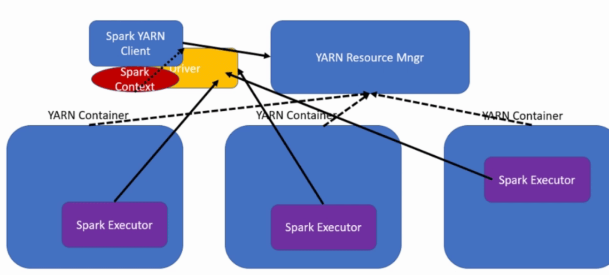
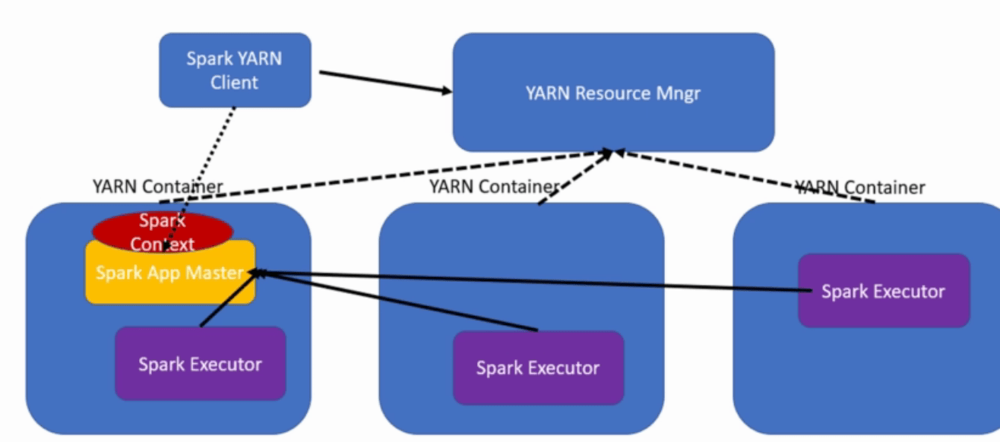

# Playbook

## Quick setup for Spark on Yarn cluster

### Add ssh pub key of Kata1 to other nodes

### Modify the host

add all ip addresses to the hosts on every node

```
x.x.x.x kata1
x.x.x.x kata2
.......
```

### Install Spark

you can actually do this only on master node

```sh
wget https://dlcdn.apache.org/spark/spark-3.5.0/spark-3.5.0-bin-hadoop3.tgz
tar -xvzf spark-3.5.0-bin-hadoop3.tgz
mv spark-3.5.0-bin-hadoop3.tgz /usr/local/spark
```

edit `~/.bashrc`

```bash
export SPARK_HOME=/usr/local/spark
export PATH=$PATH:$SPARK_HOME/bin:$SPARK_HOME/sbin
```

```sh
source ~/.bashrc
```

### Install Hadoop

This must be done on every node

https://dlcdn.apache.org/hadoop/common/hadoop-3.3.6/hadoop-3.3.6.tar.gz

```sh
wget https://dlcdn.apache.org/hadoop/common/hadoop-3.3.6/hadoop-3.3.6.tar.gz
tar -xvzf hadoop-3.3.6.tar.gz
mv hadoop-3.3.6 /usr/local/hadoop
```

edit`~/.bashrc`

```bash
export HADOOP_HOME=/path/to/hadoop-3.x.x
export PATH=$PATH:$HADOOP_HOME/bin:$HADOOP_HOME/sbin
```

```sh
source ~/.bashrc
```

edit `hadoop-env.sh`, add below:

```
export JAVA_HOME=/usr/lib/jvm/java-8-openjdk-amd64
```


### Edit Hadoop

1. `$HADOOP_HOME/etc/hadoop/core-site.xml`

```xml
<property>
    <name>fs.defaultFS</name>
    <value>hdfs://kata1:9000</value>
</property>
```
2. **Edit hdfs-site.xml (optional):** In `etc/hadoop/hdfs-site.xml`, add:

```xml
<property>
   <name>dfs.replication</name>
   <value>3</value>
</property>
```
3. **Edit mapred-site.xml:** In `etc/hadoop/mapred-site.xml`, add:

```xml
<property>
   <name>mapreduce.framework.name</name>
   <value>yarn</value>
</property>
```

4. **Edit yarn-site.xml:** In `etc/hadoop/yarn-site.xml`, add:

```xml
<property>
   <name>yarn.resourcemanager.hostname</name>
   <value>kata1</value>
</property>
```

5. **Edit workers (on master node):** In `etc/hadoop/workers`, add:

```
kata2
kata3
kata4
```

6. **Format HDFS (on master node):** Run the following command:

```sh
hdfs namenode -format
rm -r /tmp/hadoop-ubuntu/dfs/data/current
```

7. **Start the Cluster (on master node):**

```sh
stop-dfs.sh
stop-yarn.sh
start-dfs.sh
start-yarn.sh
```

### Submit Spark task

```sh
cd $SPARK_HOME
./bin/spark-submit --class org.apache.spark.examples.SparkPi --master yarn --deploy-mode client --executor-memory 4g --num-executors 4 ./examples/jars/spark-examples*.jar 100
```

## Enable launching Docker containers

### Install Docker (all nodes)

```sh
# Add Docker's official GPG key:
sudo apt-get update
sudo apt-get install ca-certificates curl gnupg
sudo install -m 0755 -d /etc/apt/keyrings
curl -fsSL https://download.docker.com/linux/ubuntu/gpg | sudo gpg --dearmor -o /etc/apt/keyrings/docker.gpg
sudo chmod a+r /etc/apt/keyrings/docker.gpg

# Add the repository to Apt sources:
echo \
  "deb [arch="$(dpkg --print-architecture)" signed-by=/etc/apt/keyrings/docker.gpg] https://download.docker.com/linux/ubuntu \
  "$(. /etc/os-release && echo "$VERSION_CODENAME")" stable" | \
  sudo tee /etc/apt/sources.list.d/docker.list > /dev/null
sudo apt-get update
```

```sh
sudo apt-get install docker-ce docker-ce-cli containerd.io docker-buildx-plugin docker-compose-plugin
sudo docker run hello-world
sudo docker pull library/openjdk:8
```

### Enable Linux Container Executor

1. add below to `yarn-site.xml`

```xml
<property>    
  <name>yarn.nodemanager.container-executor.class</name>
  <value>org.apache.hadoop.yarn.server.nodemanager.LinuxContainerExecutor</value>
  <description>
    This is the container executor setting that ensures that all applications
    are started with the LinuxContainerExecutor.
  </description>
</property>

<property>
  <name>yarn.nodemanager.linux-container-executor.group</name>
  <value>ubuntu</value>
</property>

<property>
  <name>yarn.nodemanager.linux-container-executor.nonsecure-mode.limit-users</name>
  <value>true</value>
</property>

<property>
  <name>yarn.nodemanager.linux-container-executor.nonsecure-mode.local-user</name>
  <value>ubuntu</value>
</property>
```

2. edit `container-executor.cfg`

```
yarn.nodemanager.linux-container-executor.group=ubuntu
allowed.system.users=hdfs,yarn,mapred,ubuntu
banned.users=root,bin
min.user.id=100
```

3. grant permissions

```sh
sudo chown root:ubuntu /usr/local/hadoop/bin/container-executor 
sudo chmod 6050 /usr/local/hadoop/bin/container-executor

sudo chown root:ubuntu /usr/local/hadoop/etc/hadoop/container-executor.cfg
sudo chmod 0400 /usr/local/hadoop/etc/hadoop/container-executor.cfg

sudo chown root:ubuntu /usr/local/hadoop
sudo chown root:ubuntu /usr/local/hadoop/etc
sudo chown root:ubuntu /usr/local/hadoop/etc/hadoop
```

### Enable Docker

1. add below to `yarn-site.xml`

```xml
<property>
  <name>yarn.nodemanager.runtime.linux.allowed-runtimes</name>
  <value>default,docker</value>
  <description>
    Comma separated list of runtimes that are allowed when using
    LinuxContainerExecutor. The allowed values are default, docker, and
    javasandbox.
  </description>
</property>

<property>
  <name>yarn.nodemanager.runtime.linux.type</name>
  <value>docker</value>
  <description>
    Optional. Sets the default container runtime to use.
  </description>
</property>

  <property>
    <name>yarn.nodemanager.runtime.linux.docker.image-name</name>
    <value>library/openjdk:8</value>
    <description>
      Optional. Default docker image to be used when the docker runtime is
      selected.
    </description>
  </property>

  <property>
    <name>yarn.nodemanager.runtime.linux.docker.default-container-network</name>
    <value>host</value>
    <description>
      The network used when launching Docker containers when no
      network is specified in the request. This network must be one of the
      (configurable) set of allowed container networks.
    </description>
  </property>

  <property>
    <name>yarn.nodemanager.runtime.linux.docker.host-pid-namespace.allowed</name>
    <value>False</value>
    <description>
      Optional. Whether containers are allowed to use the host PID namespace.
    </description>
  </property>

  <property>
    <name>yarn.nodemanager.aux-services</name>
    <value>mapreduce_shuffle</value>
  </property>
  <property>
    <name>yarn.nodemanager.aux-services.mapreduce_shuffle.class</name>
    <value>org.apache.hadoop.mapred.ShuffleHandler</value>
  </property>

<property>
   <name>yarn.nodemanager.env-whitelist</name>
      <value>JAVA_HOME,HADOOP_COMMON_HOME,HADOOP_HDFS_HOME,HADOOP_CONF_DIR,CLASSPATH_PREPEND_DISTCACHE,HADOOP_YARN_HOME,HADOOP_MAPRED_HOME</value>
</property>
```

2. add below to `container-executor.cfg`

```
[docker]
  module.enabled=true
  docker.trusted.registries=library
  docker.allowed.capabilities=SYS_CHROOT,MKNOD,SETFCAP,SETPCAP,FSETID,CHOWN,AUDIT_WRITE,SETGID,NET_RAW,FOWNER,SETUID,DAC_OVERRIDE,KILL,NET_BIND_SERVICE
  docker.allowed.networks=bridge,host,none
  docker.allowed.ro-mounts=/usr/local/hadoop,/etc/passwd,/etc/group,/usr/local/hadoop/share/hadoop/mapreduce/
  docker.allowed.rw-mounts=/usr/local/hadoop/logs/userlogs/,/tmp/hadoop-ubuntu/nm-local-dir/
```

3. add below to `mapred-site.xml`

```xml
<property>
    <name>yarn.app.mapreduce.am.env</name>
    <value>HADOOP_MAPRED_HOME=/usr/local/hadoop</value>
</property>
<property>
    <name>mapreduce.map.env</name>
    <value>HADOOP_MAPRED_HOME=/usr/local/hadoop</value>
</property>
<property>
    <name>mapreduce.reduce.env</name>
    <value>HADOOP_MAPRED_HOME=/usr/local/hadoop</value>
</property>
```

4. submit a spark-pi test to run:

```sh
 MOUNTS="$HADOOP_HOME:$HADOOP_HOME:ro,/etc/passwd:/etc/passwd:ro,/etc/group:/etc/group:ro,/usr/local/hadoop/share/hadoop/mapreduce:/usr/local/hadoop/share/hadoop/mapreduce:ro,/tmp/hadoop-ubuntu/nm-local-dir:/tmp/hadoop-ubuntu/nm-local-dir:rw,/var/log/myapp:/var/log/myapp:rw,/tmp/hadoop-ubuntu/nm-local-dir/usercache/ubuntu:/tmp/hadoop-ubuntu/nm-local-dir/usercache/ubuntu:rw"
    IMAGE_ID="library/openjdk:8"

 

  $SPARK_HOME/bin/spark-submit \
  --class org.apache.spark.examples.SparkPi \
  --master yarn \
  --deploy-mode client \
  --executor-memory 1g \
  --num-executors 2 \
  --conf spark.yarn.appMasterEnv.YARN_CONTAINER_RUNTIME_TYPE=docker \
  --conf spark.yarn.appMasterEnv.YARN_CONTAINER_RUNTIME_DOCKER_IMAGE=$IMAGE_ID \
  --conf spark.yarn.appMasterEnv.YARN_CONTAINER_RUNTIME_DOCKER_MOUNTS=$MOUNTS \
  --conf spark.executorEnv.YARN_CONTAINER_RUNTIME_TYPE=docker \
  --conf spark.executorEnv.YARN_CONTAINER_RUNTIME_DOCKER_IMAGE=$IMAGE_ID \
  --conf spark.executorEnv.YARN_CONTAINER_RUNTIME_DOCKER_MOUNTS=$MOUNTS \
  --conf spark.driver.bindAddress="0.0.0.0" \
  --conf spark.driver.host="172.17.0.1" \
  --conf spark.driver.port="1234" \
  --conf spark.blockManager.bindAddress="0.0.0.0" \
  --conf spark.blockManager.port=35430 \
  --conf spark.yarn.appMasterEnv.YARN_CONTAINER_RUNTIME_DOCKER_CONTAINER_NETWORK=host \
  --conf spark.yarn.executorEnv.YARN_CONTAINER_RUNTIME_DOCKER_CONTAINER_NETWORK=host \
  --conf spark.yarn.executorEnv.YARN_CONTAINER_RUNTIME_DOCKER_PORTS_MAPPING="35430:35430"\
  --conf spark.driver.blockManager.port=44349 \
  $SPARK_HOME/examples/jars/spark-examples*.jar 1


  IMAGE_ID="kata-app"
```

```sh

```

```sh
  $SPARK_HOME/bin/spark-submit \
  --class org.apache.spark.examples.SparkPi \
  --master yarn \
  --deploy-mode cluster \
  --executor-memory 2g \
  --num-executors 6 \
  --conf spark.yarn.appMasterEnv.YARN_CONTAINER_RUNTIME_TYPE=docker \
  --conf spark.yarn.appMasterEnv.YARN_CONTAINER_RUNTIME_DOCKER_IMAGE=$IMAGE_ID \
  --conf spark.yarn.appMasterEnv.YARN_CONTAINER_RUNTIME_DOCKER_MOUNTS=$MOUNTS \
  --conf spark.executorEnv.YARN_CONTAINER_RUNTIME_TYPE=docker \
  --conf spark.executorEnv.YARN_CONTAINER_RUNTIME_DOCKER_IMAGE=$IMAGE_ID \
  --conf spark.executorEnv.YARN_CONTAINER_RUNTIME_DOCKER_MOUNTS=$MOUNTS \
  --conf spark.driver.blockManager.port=44349 \
  $SPARK_HOME/examples/jars/spark-examples*.jar 1000
```

```sh
  $SPARK_HOME/bin/spark-submit \
  --class org.apache.spark.examples.SparkPi \
  --master yarn \
  --deploy-mode client \
  --executor-memory 1g \
  --num-executors 1 \
  --conf spark.yarn.appMasterEnv.YARN_CONTAINER_RUNTIME_TYPE=docker \
  --conf spark.yarn.appMasterEnv.YARN_CONTAINER_RUNTIME_DOCKER_IMAGE=$IMAGE_ID \
  --conf spark.yarn.appMasterEnv.YARN_CONTAINER_RUNTIME_DOCKER_MOUNTS=$MOUNTS \
  --conf spark.executorEnv.YARN_CONTAINER_RUNTIME_TYPE=docker \
  --conf spark.executorEnv.YARN_CONTAINER_RUNTIME_DOCKER_IMAGE=$IMAGE_ID \
  --conf spark.executorEnv.YARN_CONTAINER_RUNTIME_DOCKER_MOUNTS=$MOUNTS \
  --conf spark.driver.bindAddress="0.0.0.0" \
  --conf spark.driver.port="1234" \
  --conf spark.bindAddress="0.0.0.0" \
  --conf spark.blockManager.port=35430 \
  --conf spark.driver.blockManager.port=44349 \
  --conf spark.executorEnv.YARN_CONTAINER_RUNTIME_DOCKER_PORTS_MAPPING="35430:35430,35445:35445"\
  $SPARK_HOME/examples/jars/spark-examples*.jar 1
```


## Enable Kata Containers (in Docker)

### Install Kata Container Runtime

```sh
ARCH=$(arch)
BRANCH="${BRANCH:-master}"
sudo sh -c "echo 'deb http://download.opensuse.org/repositories/home:/katacontainers:/releases:/${ARCH}:/${BRANCH}/xUbuntu_$(lsb_release -rs)/ /' > /etc/apt/sources.list.d/kata-containers.list"
curl -sL  http://download.opensuse.org/repositories/home:/katacontainers:/releases:/${ARCH}:/${BRANCH}/xUbuntu_$(lsb_release -rs)/Release.key | sudo apt-key add -
sudo -E apt-get update
sudo -E apt-get -y install kata-runtime kata-proxy kata-shim
```

### Set Kata Runtime as Default Runtime in Docker (Optional)

1. In `/etc/docker/daemon.json`, add below:

```json
{
  "dns": ["192.168.0.68", "8.8.8.8"],
  "default-runtime":"kata-runtime",
  "runtimes": {
    "kata-runtime": {
      "runtimeType": "io.containerd.kata.v2"
    }
  }
}
```

> The dns is set as the host address so that it can resolve the hostnames in the cluster

2. Reload Docker Daemon

```sh
sudo modprobe vhost_net
sudo systemctl daemon-reload
sudo systemctl restart docker
sudo docker info | grep -i runtime
```

> To get more debug info from docker engine, use `sudo journalctl -xu docker.service`

### Submit a Spark Task

#### Use Client Mode

```sh
  $SPARK_HOME/bin/spark-submit \
  --class org.apache.spark.examples.SparkPi \
  --master yarn \
  --deploy-mode client \
  --executor-memory 2g \
  --num-executors 6 \
  --conf spark.yarn.appMasterEnv.YARN_CONTAINER_RUNTIME_TYPE=docker \
  --conf spark.yarn.appMasterEnv.YARN_CONTAINER_RUNTIME_DOCKER_IMAGE=$IMAGE_ID \
  --conf spark.yarn.appMasterEnv.YARN_CONTAINER_RUNTIME_DOCKER_MOUNTS=$MOUNTS \
  --conf spark.executorEnv.YARN_CONTAINER_RUNTIME_TYPE=docker \
  --conf spark.executorEnv.YARN_CONTAINER_RUNTIME_DOCKER_IMAGE=$IMAGE_ID \
  --conf spark.executorEnv.YARN_CONTAINER_RUNTIME_DOCKER_MOUNTS=$MOUNTS \
  --conf spark.driver.blockManager.port=44349 \
  $SPARK_HOME/examples/jars/spark-examples*.jar 1000
```



#### Use Cluster Mode

```sh
  $SPARK_HOME/bin/spark-submit \
  --class org.apache.spark.examples.SparkPi \
  --master yarn \
  --deploy-mode cluster \
  --executor-memory 2g \
  --num-executors 6 \
  --conf spark.yarn.appMasterEnv.YARN_CONTAINER_RUNTIME_TYPE=docker \
  --conf spark.yarn.appMasterEnv.YARN_CONTAINER_RUNTIME_DOCKER_CONTAINER_NETWORK=host \
  --conf spark.yarn.appMasterEnv.YARN_CONTAINER_RUNTIME_DOCKER_IMAGE=$IMAGE_ID \
  --conf spark.yarn.appMasterEnv.YARN_CONTAINER_RUNTIME_DOCKER_MOUNTS=$MOUNTS \
  --conf spark.executorEnv.YARN_CONTAINER_RUNTIME_TYPE=docker \
  --conf spark.executorEnv.YARN_CONTAINER_RUNTIME_DOCKER_IMAGE=$IMAGE_ID \
  --conf spark.executorEnv.YARN_CONTAINER_RUNTIME_DOCKER_MOUNTS=$MOUNTS \
  --conf spark.executorEnv.YARN_CONTAINER_RUNTIME_DOCKER_CONTAINER_NETWORK=bridge \
  $SPARK_HOME/examples/jars/spark-examples*.jar 1
```



#### Submit TPC-H Task

```sh
$SPARK_HOME/bin/spark-submit --class "main.scala.TpchQuery" --master yarn --deploy-mode client --executor-memory 2g --num-executors 3 --conf spark.yarn.appMasterEnv.YARN_CONTAINER_RUNTIME_TYPE=docker --conf spark.yarn.appMasterEnv.YARN_CONTAINER_RUNTIME_DOCKER_IMAGE=$IMAGE_ID --conf spark.yarn.appMasterEnv.YARN_CONTAINER_RUNTIME_DOCKER_MOUNTS=$MOUNTS --conf spark.executorEnv.YARN_CONTAINER_RUNTIME_TYPE=docker --conf spark.executorEnv.YARN_CONTAINER_RUNTIME_DOCKER_IMAGE=$IMAGE_ID --conf spark.executorEnv.YARN_CONTAINER_RUNTIME_DOCKER_MOUNTS=$MOUNTS $SPARK_HOME/examples/jars/spark-tpc-h-queries_2.12-1.0.jar
```


```sh
  HADOOP_HOME=/usr/local/hadoop
  YARN_EXAMPLES_JAR=$HADOOP_HOME/share/hadoop/mapreduce/hadoop-mapreduce-examples-*.jar
  MOUNTS="$HADOOP_HOME:$HADOOP_HOME:ro,/etc/passwd:/etc/passwd:ro,/etc/group:/etc/group:ro,/usr/local/hadoop/share/hadoop/mapreduce:/usr/local/hadoop/share/hadoop/mapreduce:ro"
  IMAGE_ID="library/openjdk:8"

  export YARN_CONTAINER_RUNTIME_TYPE=docker
  export YARN_CONTAINER_RUNTIME_DOCKER_IMAGE="library/openjdk:8"
  export YARN_CONTAINER_RUNTIME_DOCKER_MOUNTS="$HADOOP_HOME:$HADOOP_HOME:ro,/etc/passwd:/etc/passwd:ro,/etc/group:/etc/group:ro,/usr/local/hadoop/share/hadoop/mapreduce:/usr/local/hadoop/share/hadoop/mapreduce:ro"

  yarn jar $YARN_EXAMPLES_JAR pi \
    -Dmapreduce.map.env.YARN_CONTAINER_RUNTIME_TYPE=docker \
    -Dmapreduce.map.env.YARN_CONTAINER_RUNTIME_DOCKER_MOUNTS="$HADOOP_HOME:$HADOOP_HOME:ro,/etc/passwd:/etc/passwd:ro,/etc/group:/etc/group:ro,/usr/local/hadoop/share/hadoop/mapreduce:/usr/local/hadoop/share/hadoop/mapreduce:ro" \
    -Dmapreduce.map.env.YARN_CONTAINER_RUNTIME_DOCKER_IMAGE="library/openjdk:8" \
    -Dmapreduce.map.env.HADOOP_MAPRED_HOME="/usr/local/hadoop" \
    -Dmapreduce.reduce.env.YARN_CONTAINER_RUNTIME_TYPE=docker \
    -Dmapreduce.reduce.env.YARN_CONTAINER_RUNTIME_DOCKER_MOUNTS="$HADOOP_HOME:$HADOOP_HOME:ro,/etc/passwd:/etc/passwd:ro,/etc/group:/etc/group:ro,/usr/local/hadoop/share/hadoop/mapreduce:/usr/local/hadoop/share/hadoop/mapreduce:ro" \
    -Dmapreduce.reduce.env.YARN_CONTAINER_RUNTIME_DOCKER_IMAGE="library/openjdk:8" \
    -Dmapreduce.reduce.env.HADOOP_MAPRED_HOME="/usr/local/hadoop" \
    1 40000
```

```scala
val count = sc.parallelize(1 to 100000).filter { _ =>
  val x = math.random
  val y = math.random
  x*x + y*y < 1
}.count()
println(s"Pi is roughly ${4.0 * count / 100000}")
```


1. Overlay network (docker swarm)
2. registry service

