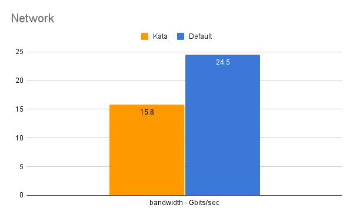

### Entry
```shell
bash network_container.sh
```

### Difference in network test (runc vs kata) analysis

runc

```textile
[ ID] Interval           Transfer     Bitrate         Retr
[  5]   0.00-10.00  sec  24.5 GBytes  21.0 Gbits/sec    0             sender
[  5]   0.00-10.04  sec  24.5 GBytes  20.9 Gbits/sec                  receiver
```

kata

```textile
[ ID] Interval           Transfer     Bitrate         Retr
[  5]   0.00-10.00  sec  15.8 GBytes  13.6 Gbits/sec    0             sender
[  5]   0.00-10.03  sec  15.8 GBytes  13.6 Gbits/sec                  receiver
```

- **Network Stack Complexity**:
  
  In `runc`, the network stack is less complex as it directly interfaces with the host's network, reducing latency and increasing throughput.
  
  `kata-runtime` involves a more complex network stack. The network packets must traverse the guest OS's network stack, the virtualization layer, and then the host OS's network stack, adding latency and potentially reducing throughput.

