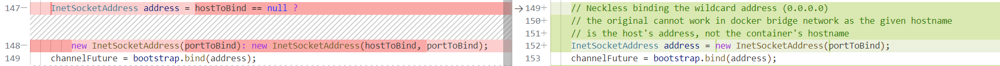
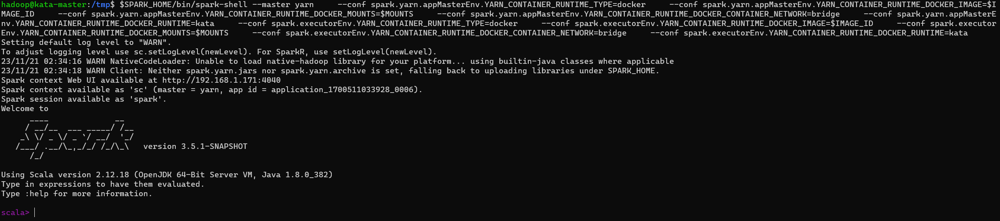
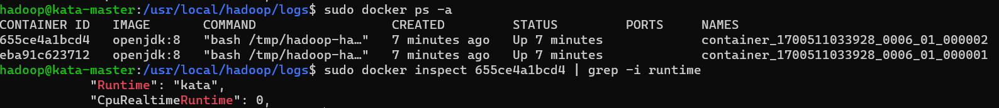
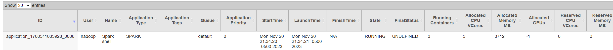

# Root Cause Analysis - Docker Bridge Network Issue (Spark on YARN)

## Background

Recently we have been stuck by the Docker bridge network issue for two sprints. We are able to submit Spark applications to YARN + Docker with host network being enabled, however, when we change the network to bridge, the Spark application was crashed due to a binding address error. We have to change the network to bridge because the Kata runtime cannot support the host network, so we have no choice but troublshooting this issue.

The issue we have encountered is not related to Kata, it's Spark cannot work properly with YARN + Docker in bridge network. Not only Kata cannot work, RunC cannot work either, which means the current Spark implementation is wrong and didn't consider bridge network while using YARN as the cluster.

## Troubleshooting

After night by night debugging, we found the root cause is in Spark Executor, there is a bug in the Spark Executor that makes it bind to a wrong address instead of its local address when the bridge network is enabled.

It is very difficult to troubleshoot this kind of issue, because we first think it's something wrong in YARN, in fact it's caused by the incompatibility between YARN and Spark. To debug Spark, the current logs in Spark are somewhat not suffcient and we also need to add more logs in their source codes, every time we did this change, we need to rebuild it, each build may take at least 10 mintues, and we have rebuilt it for at least 20 times.

### Toubleshooting Steps
Here are the steps we performed to identify the root cause:
1. Enable all logs of Spark by setting `spark.log.level ALL` in `$SPARK_HOME/conf/spark-defaults.conf` 
2. Enable all logs of netty (the network library used by Spark) by setting:
   ```
   log4j.logger.org.apache.spark.network.netty.NettyBlockRpcServer=ALL
   logging.level.reactor.netty.http.client=DEBUG
   ```
   in `$SPARK_HOME/conf/log4j2.properties`
3. Based on the detailed logs, we found that the binding address error happens while creating a new Executor by `new Executor(executorId, hostname, env, getUserClassPath, isLocal = false, resources = _resources)` in `core/src/main/scala/org/apache/spark/executor/CoarseGrainedExecutorBackend.scala:176`
4. After further investigation, we found that the error message was raised from `startServiceOnPort[T] -> startService -> TransportContext::createServer -> new TransportServer(this, host, port, rpcHandler, bootstraps) -> TransportServer::init -> bootstrap.bind(address)` --> fail!
5. Then we found the hostname that the executors try to bind is the hostname of the VM host,
   1. Which is fine for host network, because the Docker container shares the network with the host when the host network is eanbled, however, as mentioned before, it is not supported by Kata runtime.
   2. In bridge network, this hostname causes problem because the executor is trying to bind an address that does not belong to it. Note in this case, the containers in the bridge network will have a separate network from the host, and this makes things clear, how can an application bind to a hostname/IP that is not its local address? 

You may ask why Spark Executor was given the hostname of the VM host? The answer is, the current Spark on YARN implementation is wrong:
1. We can see `resource-managers/yarn/src/main/scala/org/apache/spark/deploy/yarn/YarnAllocator.scala:736`, function name: `runAllocatedContainers`, line 736 clearly states `val executorHostname = container.getNodeId.getHost` and `executorHostName` (the hostname of NodeManager) is passed into `ExecutorRunnable`.
2. In `ExecutorRunnable`, line 185, it passes `hostname` (which is `executorHostName`) into `YarnCoarseGrainedExecutorBackend` to start the executor, but `--bind-address` is not set, 
   ```scala
    YarnSparkHadoopUtil.addOutOfMemoryErrorArgument(javaOpts)
    val commands = prefixEnv ++
      Seq(Environment.JAVA_HOME.$$() + "/bin/java", "-server") ++
      javaOpts ++
      Seq("org.apache.spark.executor.YarnCoarseGrainedExecutorBackend",
        "--driver-url", masterAddress,
        "--executor-id", executorId,
        "--hostname", hostname,
        "--cores", executorCores.toString,
        "--app-id", appId,
        "--resourceProfileId", resourceProfileId.toString) ++
      Seq(
        s"1>${ApplicationConstants.LOG_DIR_EXPANSION_VAR}/stdout",
        s"2>${ApplicationConstants.LOG_DIR_EXPANSION_VAR}/stderr")
   ```
3. `YarnCoarseGrainedExecutorBackend` will then call `CoarseGrainedExecutorBackend`, and `CoarseGrainedExecutorBackend` will set `bindAddress` to `hostname` (which is `executorHostName` if `bindAddress` is `null`!!!
4. In `CoarseGrainedExecutorBackend`, line 479, the `bindAddress` will be passed into `SparkEnv.createExecutorEnv(...)`, then will call `SparkEnv.create(...)` in `SparkEnv.createExecutorEnv(...)`.
5. In `SparkEnv`, line 365, inside the `SparkEnv.create(...)`, the `bindAddress` is passed into `new NettyBlockTransferService(...)`
6. In `NettyBlockTransferService`, the call trace is `init` -> `createServer` -> `Utils.startServiceOnPort` -> `transportContext.createServer` -> `new TransportServer` -> `TransportServer::init`
7. The `hostToBind` parameter passed in `TransportServer::init` is `bindAddress` passed from `CoarseGrainedExecutorBackend`, which is actually the `executorHostName`.
8. As mentioned before, the `executorHostName` is actually the hostname of NodeManager, if docker is using bridge network, the executor is running inside a container, and bind to a hostname that is not it's own, then the binding error occurred.

After further investigation in Spark source codes, I did find out that Spark + Kubernetes may work well in bridge network (didn't verify it but it looks good in the codes).

The reason is, Spark Executor is binding to the Pod's IP which is correct because all containers in a Pod shares the same IP which is Pod's IP.

Unfortunately, while using YARN as the cluster, Spark is binding to NodeManager's hostname which is wrong, it should bind to the container's hostname or IP instead.

### Simple Illustration


## Workaround

To mitigate this issue, we simply let the executors bind to `0.0.0.0` to avoid the bind error.

In `spark/common/network-common/src/main/java/org/apache/spark/network/server/TransportServer.java::init`, do:
```java
InetSocketAddress address = new InetSocketAddress(portToBind);
channelFuture = bootstrap.bind(address);
```



After the Spark rebuild done, simply run the following command:

```
HADOOP_HOME=/usr/local/hadoop
SPARK_HOME=/usr/local/spark
MOUNTS="$HADOOP_HOME:$HADOOP_HOME:ro,/etc/passwd:/etc/passwd:ro,/etc/group:/etc/group:ro"
IMAGE_ID="library/openjdk:8"

$SPARK_HOME/bin/spark-shell --master yarn \
    --conf spark.yarn.appMasterEnv.YARN_CONTAINER_RUNTIME_TYPE=docker \
    --conf spark.yarn.appMasterEnv.YARN_CONTAINER_RUNTIME_DOCKER_IMAGE=$IMAGE_ID \
    --conf spark.yarn.appMasterEnv.YARN_CONTAINER_RUNTIME_DOCKER_MOUNTS=$MOUNTS \
    --conf spark.yarn.appMasterEnv.YARN_CONTAINER_RUNTIME_DOCKER_CONTAINER_NETWORK=bridge \
    --conf spark.yarn.appMasterEnv.YARN_CONTAINER_RUNTIME_DOCKER_RUNTIME=kata \
    --conf spark.executorEnv.YARN_CONTAINER_RUNTIME_TYPE=docker \
    --conf spark.executorEnv.YARN_CONTAINER_RUNTIME_DOCKER_IMAGE=$IMAGE_ID \
    --conf spark.executorEnv.YARN_CONTAINER_RUNTIME_DOCKER_MOUNTS=$MOUNTS \
    --conf spark.executorEnv.YARN_CONTAINER_RUNTIME_DOCKER_CONTAINER_NETWORK=bridge \
    --conf spark.executorEnv.YARN_CONTAINER_RUNTIME_DOCKER_RUNTIME=kata
```

It should work without any errors.

## Screenshots




## Action Items

- [x] Check the most recent Spark source codes to see if this issue was fixed in a PR. (Checked, no active issues related to this, no PRs either)
- [ ] Modify the Spark source codes to let executors be able to bind the container's hostname instead of NodeManager's hostname.
- [ ] Modify the Spark source codes to let executors be able to bind `SPARK_LOCAL_IP` if it is set (highest priority) and raise a PR to Spark official Github repo. (optional)

## Open Issues
1. How do we modify the Spark source codes to let executors be able to bind the container's hostname instead of NodeManager's hostname?
   This is not a easy solution. Because, if you check what kind of information is included in `org.apache.hadoop.yarn.api.records.Container`, you will find out that, it does not expose container's hostname or IPs:
   ```
     public static Container newInstance(ContainerId containerId, NodeId nodeId,
         String nodeHttpAddress, Resource resource, Priority priority,
         Token containerToken, ExecutionType executionType) {
       Container container = Records.newRecord(Container.class);
       container.setId(containerId);
       container.setNodeId(nodeId);
       container.setNodeHttpAddress(nodeHttpAddress);
       container.setResource(resource);
       container.setPriority(priority);
       container.setContainerToken(containerToken);
       container.setExecutionType(executionType);
       return container;
     }
   ```
   Which means, to solve this issue, we may need to change both YARN's Container API and Spark, this is going to be a tough work and may bring more questions to be discussed. 
